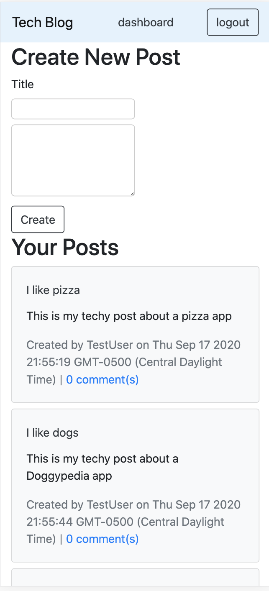
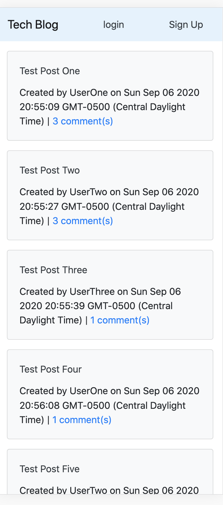

# Tech Blog

## Description
Tech blog is a social media style application that allows users to share ideas and ask technology related questions. Anyone can read posts and comments, but a user must create an account to access their dashboard, post and make comments on posts.

 

